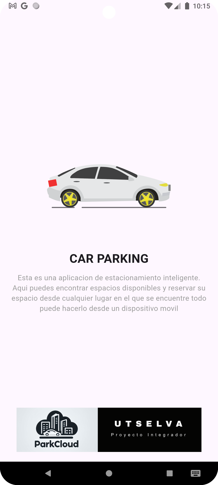
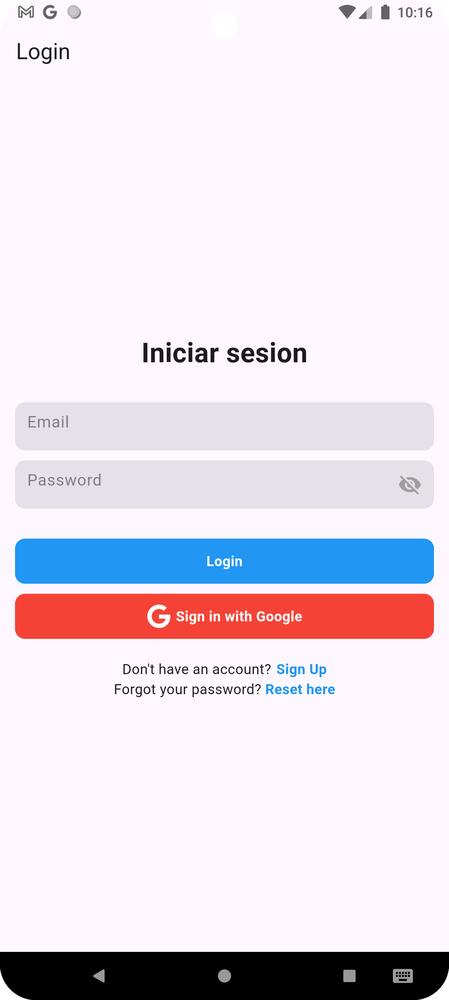
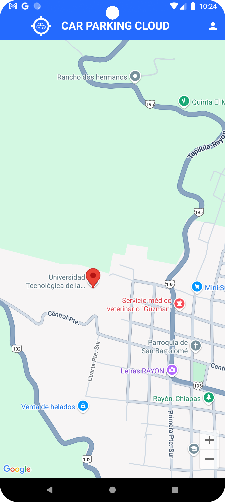
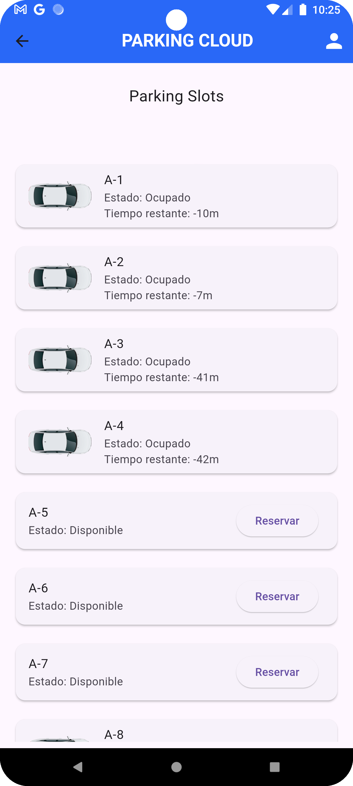
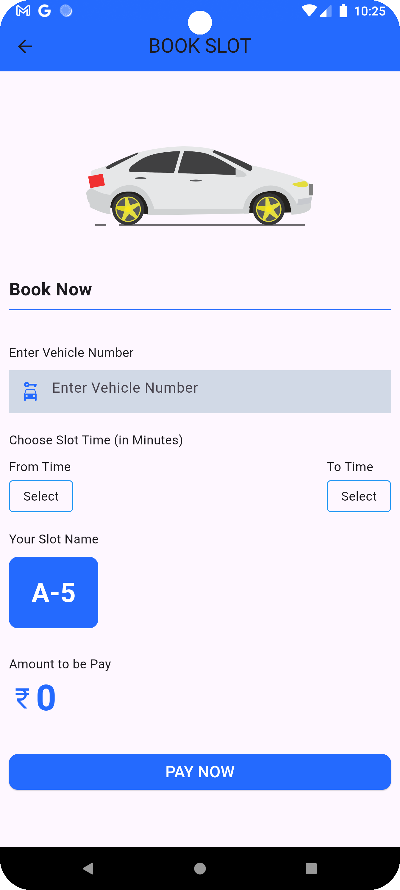
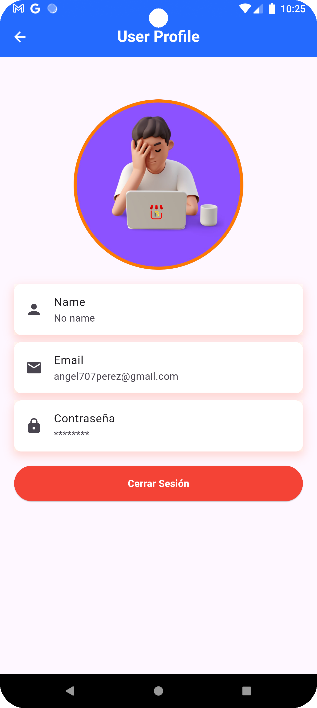

# 🚗 ParkCloud

**ParkCloud** es una aplicación móvil desarrollada en Flutter cuyo propósito es mejorar la experiencia de los usuarios al buscar un lugar para estacionarse. La app permite visualizar en tiempo real el tiempo restante de ocupación de cada espacio, lo que reduce significativamente el tiempo de espera en los estacionamientos.

---

## 📱 Capturas de pantalla

### Pantalla principal  

### Inicio de Sesión  

### Ubicación del Estacionamiento  

### Vista de mapa con espacios  

### Reserva de Espacio  

### Perfil del usuario  

---

## 🚀 Funcionalidades

- Visualización en tiempo real de los espacios disponibles en el estacionamiento.
- Estimación del tiempo restante de ocupación de cada lugar.
- Interfaz intuitiva y moderna desarrollada con Flutter.
- Conexión con Firebase para manejo de datos.

---

## 🛠️ Tecnologías utilizadas

- **Flutter** – para el desarrollo multiplataforma.
- **Firebase** – base de datos en tiempo real.
- **Google Maps** – para mostrar los lugares de estacionamiento.
- **GetX** – para navegación y estado.
- **Dart** – lenguaje principal.

---

## 🚧 En desarrollo

Este proyecto aún está en evolución. Se están integrando funcionalidades como:

- Pago en línea.
- Reserva de espacios.
- Notificaciones push cuando un espacio se libera.

---

## 📚 Recursos útiles

- [Documentación oficial de Flutter](https://docs.flutter.dev/)
- [Codelab: Tu primera app en Flutter](https://docs.flutter.dev/get-started/codelab)
- [Firebase para Flutter](https://firebase.flutter.dev/)
- [Cookbook de Flutter](https://docs.flutter.dev/cookbook)

---

## 👨‍💻 Autor

- David Hernández – [GitHub](https://github.com/Dave0097-hdz)

---

## 📄 Licencia

Este proyecto es de uso educativo y personal. Puedes utilizarlo como base para tus propios desarrollos respetando la autoría original.

